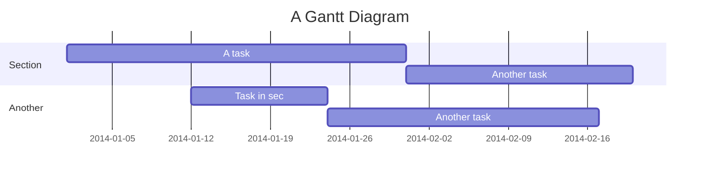

# ISU 2020 Spring Graduate Project

## CI/CD Pipeline

## Project Timeline

> Read more about Mermaid: http://mermaid-js.github.io/mermaid/

##### Write by HsuKC on 23/05/20
###### Tags: `AIoT` `Cloud computing`
